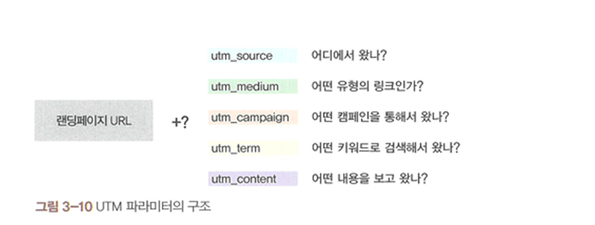
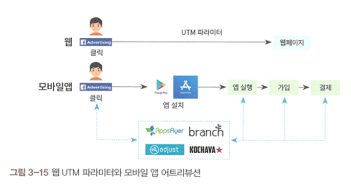
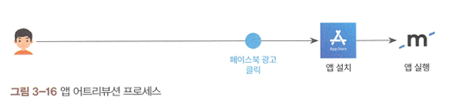
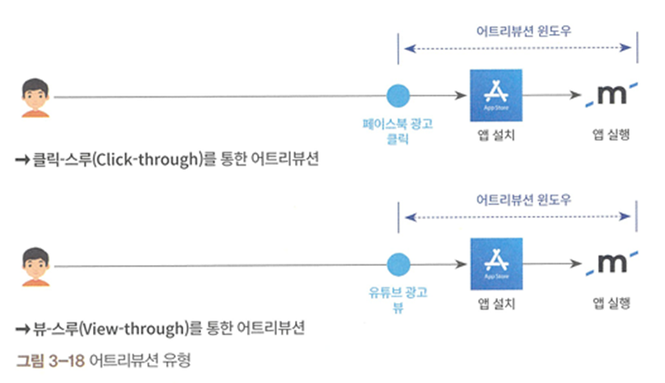
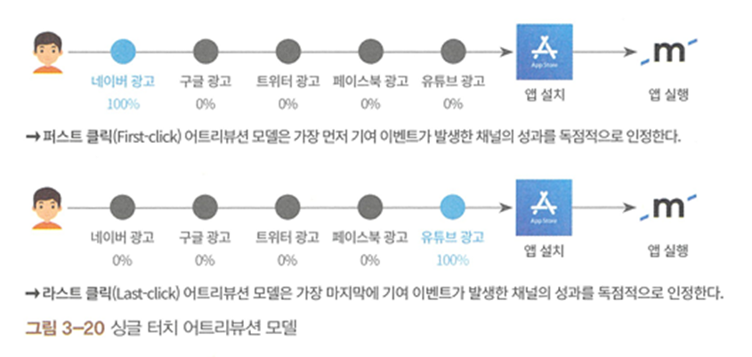
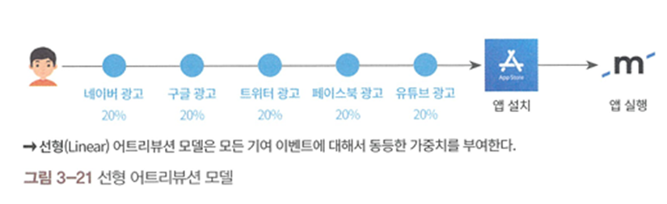
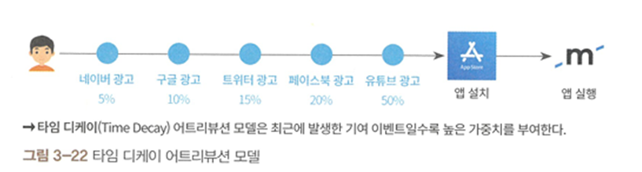
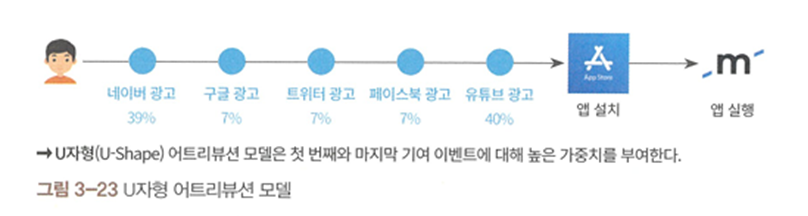
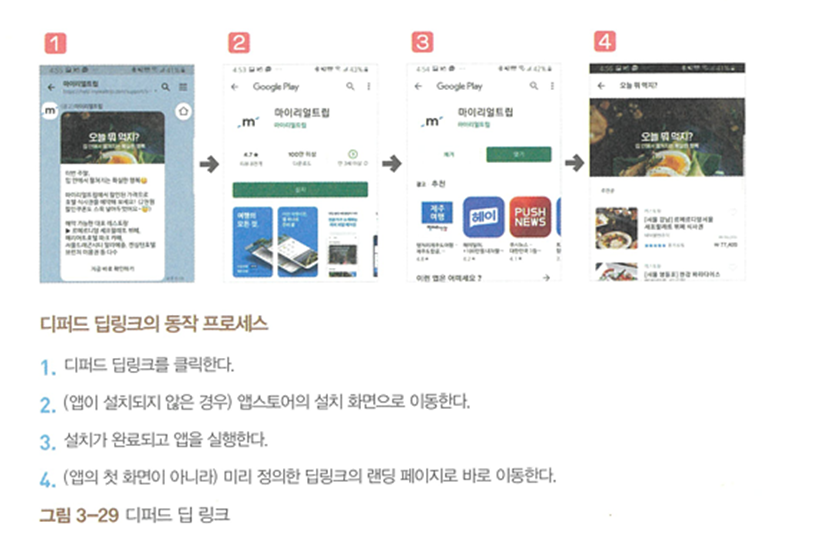

3.2 고객 유치 (Acquisition)
---

소스(Source): 트래픽이 유입된 구체적인 장소 정보

UTM 파라미터(UTM parameter): 온라인 유입 경로를 확인하기 위해 URL 뒤에 추가하는 파라미터로, 소스(utm_source), 매체(utm_medium), 캠페인(utm_campaign), 검색어(utm_term), 콘텐츠(utm_content)로 구성

어트리뷰션(Attribution): 사용자가 앱을 설치하고 사용하는 데 어떤 채널이 기여했는지 식별하여 마케팅 성과를 판단하는 과정

어트리뷰션 윈도우(Attribution window / 룩백 윈도우): 기여 이벤트 발생 후 얼마만큼의 기간 내에 발생한 전환을 기여로 인정할 것인지에 대한 기준

클릭-스루(Click-through): 광고 클릭을 통해 발생하는 기여

뷰-스루(View-through): 광고 조회(노출)를 통해 발생하는 기여

싱글 터치 어트리뷰션 모델: 여러 접점 중 하나만 인정하는 모델, 퍼스트 클릭(첫 번째 매체 100% 인정)과 라스트 클릭(마지막 매체 100% 인정)

멀티 터치 어트리뷰션 모델: 여러 접점에 기여도를 분배하는 모델로, 모든 매체에 동일 가중치를 주는 선형 모델, 시간에 따라 가중치를 높이는 타임 디케이 모델, 처음과 끝에 높은 가중치를 주는 U자형 모델 등

딥 링크(Deep Link): 모바일 앱 내 특정 화면으로 바로 이동하게 하는 링크

디퍼드 딥 링크(Deferred Deep Link): 앱 미설치자가 링크 클릭 시, 앱 설치 후 실행했을 때 미리 정의된 특정 화면으로 이동시키는 기술

웹에서는 UTM 파라미터로 유입 경로를 파악할 수 있지만, 앱은 앱스토어를 거치며 파라미터가 유실되므로 별도의 어트리뷰션 서비스(Appsflyer, Adjust 등) 활용이 필수.
단순히 오가닉(Organic) 유입을 늘리는 것보다 유입 경로를 알 수 없는 미식별(Unknown) 트래픽의 비중을 줄여 정확한 데이터를 확보하는 것이 고객 유치의 핵심

3.3 활성화 (Activation) (p.96 ~ p.109)
---

온보딩(On-boarding): 사용자가 서비스 핵심 가치를 경험하게 만드는 초기 과정을 의미

퍼널(Funnel): 사용자가 서비스 진입 후 핵심 기능 이용까지의 여정을 단계별로 도식화한 것

아하 모먼트(Aha moment) / 머스트 해브(Must have): 사용자가 서비스의 핵심 가치를 느끼는 결정적인 순간

크리티컬 패스(Critical Path): 사용자가 핵심 가치를 경험하기까지 도달해야 하는 필수 경로

코호트(Cohort): 공통된 특성(가입 시점, 유입 채널 등)을 가진 사용자 그룹

활성화를 개선하기 위해서는 퍼널 분석을 통해 어느 단계에서 이탈이 발생하는지 파악해야 함. 이때 전환율은 트래픽 기반(UX/UI 개선에 유리)과 사용자 기반(상품 매력도 판단에 유리)으로 나누어 볼 수 있음. 단순 평균치보다는 코호트별로 쪼개어 분석할 때 실질적인 선행 지표를 발견하기 쉬움.

3.4 리텐션 (Retention) (p.110 ~ p.125)
---

클래식 리텐션: 특정 날(Day N)에 재방문한 사용자의 비율

범위 리텐션: 특정 기간(주/월) 내 재방문한 사용자의 비율

롤링 리텐션: 마지막 방문일 이후 이탈하지 않은 사용자 비율로, '떠나버린 유저'를 제외하고 집계

인게이지먼트(Engagement / Stickiness): DAU를 MAU로 나눈 값으로, 사용자가 얼마나 반복적으로 들어오는지 나타냄

리텐션 차트(Retention Chart): 코호트별로 시간이 지남에 따라 리텐션이 어떻게 변하는지 보여주는 삼각형 형태의 차트

리텐션은 개선하기 가장 어렵지만, 복리 효과가 있어 서비스 성장에 가장 큰 영향을 미침. 초기 이탈을 방지하기 위해 NUX(신규 사용자 경험)를 개선하고, 이후 안정화 단계에서는 CRM 마케팅 등을 통해 지속적인 관계를 유지해야 함

3.5 수익화 (Revenue) (p.126 ~ p.141)
---

ARPU(Average Revenue Per User): 인당 평균 매출

ARPPU(Average Revenue Per Paying User): 결제자 인당 평균 매출

LTV(Lifetime Value): 한 명의 사용자가 유입부터 이탈까지 발생시키는 전체 수익의 기대치

LTR(Lifetime Revenue): 실제 데이터 기반의 고객 생애 매출

CAC(Customer Acquisition Cost): 한 명의 사용자를 데려오는 데 드는 비용

MRR(Monthly Recurring Revenue): 구독 서비스에서의 월별 반복 매출

비즈니스가 지속 가능하려면 LTR이 CAC보다 훨씬 커야 하며(최소 3배 이상), 마케팅 비용을 회수하는 기간(Payback Period)을 관리해야 함. 매출은 '가입자 × 리텐션 × 결제 비율 × ARPPU'의 퍼널 구조로 쪼개어 분석하면 성과 저하의 구체적인 원인을 찾을 수 있음.

3.6 추천 (Referral) (p.142 ~ p.151)
---

바이럴 계수(Viral Coefficient): 기존 사용자 한 명이 데려오는 신규 사용자 수, (사용자 수 × 초대 비율 × 인당 초대 수 × 전환율) / 사용자 수로 계산

바이럴 루프(Viral Loop): 추천을 통해 들어온 유저가 다시 다른 유저를 초대하는 선순환 구조

추천 시스템이 성공하려면 단순 보상보다는 추천자와 피추천자 모두에게 자연스러운 '초대 맥락(Context)'을 설계하는 것이 중요. 

추천으로 유입된 유저가 원활하게 서비스에 안착할 수 있도록 온보딩 프로세스가 뒷받침되어야 함.
