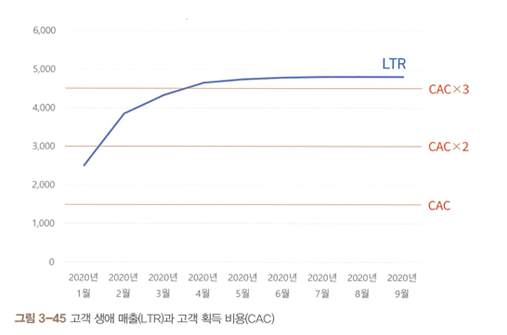

각 파트 별 토의 주제
---

1. 퍼널의 세부 단계 정의하기 p.82
    -> 아하 모먼트, 머스트 해브의 추출은 데이터 기반? 아니면 내부 직원들의 생각? 리뷰와 홍보 메시지의 일치도를 판단한다면 다를 때는 어떻게?

2. 고객 생애 매출(LTR)과 고객 획득 비용(CAC)
    -> 건강한 서비스라면 고객 가입 후 고객 생애 매출이 고객 획득 비용을 3배 초과하게 되고 그 이후 안정화되며 더 이상 크게 증가하지는 않는다고 했는데 왜 증가하지 않는 것인 것 같고 이후에는 어떻게 해야 하는 지?
    -> 건강한 서비스의 이상적인 비율을 맞추기 위해 마케팅 비용을 줄이는 게 빠를까, 인당 매출(ARPPU)을 높이는 게 빠를까? - 당연히 마케팅 비용 줄이는 게 빠르겠지만 전체 revenue도 같이 줄어들지는 않나? 그 비율은 어떻게 맞출까?

