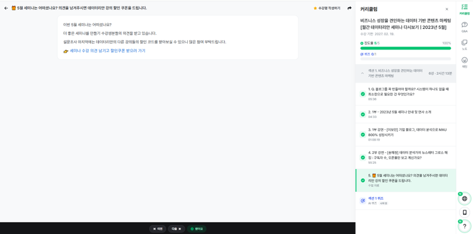

스타트업 데이터 기반 의사 결정

-> 가장 도움이 크게 됐던 강의는 2부 강연 - 비즈옵스 관점에서 바라본 데이터 분석: 쓸모있는 데이터 vs 비즈니스를 해치는 데이터
        - 이유는 책에서 학습한 내용들을 비즈옵스 실무자의 관점에서 체득한 내용들을 토대로 설명해주신 점이 좋았고 추상적이던 내용들을 조금은 직관적으로 정립할 수 있던 기회가 된 느낌이 들었음

비즈니스 성장을 견인하는 데이터 기반 콘텐츠 마케팅

